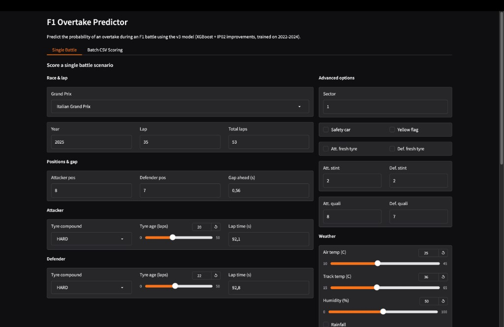
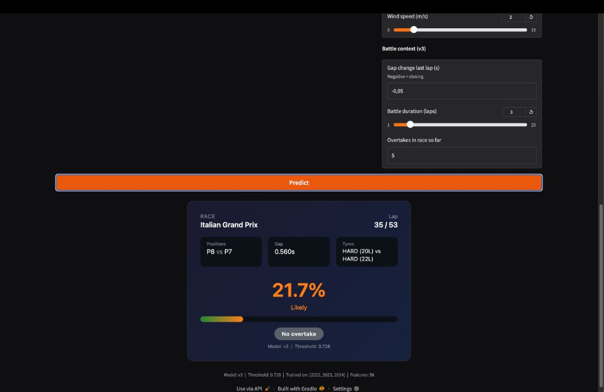

# F1 Overtake Prediction

Predict the probability of an on-track overtake during a Formula 1 battle using telemetry, tyre, weather, and race-context data from [FastF1](https://docs.fastf1.dev/).

The model answers: *given two cars battling within 1 second of each other at the start of a lap, how likely is the attacker to gain position by the next lap?*

## Results

Trained on 2022–2024 seasons, evaluated on the unseen 2025 season:

| Metric | v1 Baseline | v2 (RF) | v3 (XGBoost) |
|--------|------------|---------|--------------|
| ROC-AUC | 0.690 | 0.785 | **0.888** |
| PR-AUC | 0.080 | 0.200 | **0.467** |
| Brier | 0.040 | 0.035 | **0.037** |

**Battle-pair level** (2025 holdout): ROC-AUC **0.910**, PR-AUC **0.696** — the model reliably identifies which battles will produce overtakes.

## Project Structure

```
├── data/
│   ├── v1/                  # Original 22-column battles (2022 only)
│   ├── v2/                  # Enriched 45-column battles (2022–2025)
│   ├── v3/                  # IP02-fixed 51-column battles (2022–2025)
│   └── v4/                  # IP03: track_type fix, sectors, horizons, driver rates (62 cols)
├── docs/
│   ├── problem_definition.md
│   ├── roadmap.md
│   ├── IP01.md              # Improvement proposal: baseline fixes
│   ├── IP02.md              # Improvement proposal: closing the prediction gap
│   ├── IP03.md              # Improvement proposal: battle-pair & sequence models
│   └── IP04.md              # Improvement proposal: context-aware features + app architecture
├── models/
│   ├── model_testing_1.ipynb  # v1: Logistic Regression + Random Forest baseline
│   ├── model_testing_2.ipynb  # v2: RF + calibration, GroupKFold, 2025 holdout
│   ├── model_testing_3.ipynb  # v3: XGBoost + Optuna, IP02 features, battle-pair eval
│   ├── model_testing_4.ipynb  # v4: IP03 — SHAP prune, pair model, temporal / LOCO eval
│   ├── app.py                 # Gradio web UI (single battle + batch CSV scoring)
│   ├── predict.py             # CLI batch inference
│   ├── score_battle.py        # CLI single-battle scoring
│   └── artifacts/             # Saved model pipelines and metadata (.pkl gitignored)
└── src/
    └── pipeline/
        ├── main.py            # Entry point: generate battle CSVs from FastF1
        ├── battle_detector.py # Detect battles and label overtakes
        ├── fastf1_utils.py    # FastF1 session loading, gap, speed, weather helpers
        ├── models.py          # BattleRecord dataclass (60 fields; v4 CSV +2 driver columns)
        └── track_info.py      # DRS zones, sector types, track classification
```

## Quick Start

### Prerequisites

```bash
pip install fastf1 pandas scikit-learn xgboost optuna gradio joblib shap
```

### Generate data

```bash
cd src/
python -m pipeline.main --years 2022 --output ../data/v3/battles_2022.csv --cache cache
python -m pipeline.main --years 2023 --output ../data/v3/battles_2023.csv --cache cache
python -m pipeline.main --years 2024 --output ../data/v3/battles_2024.csv --cache cache
python -m pipeline.main --years 2025 --output ../data/v3/battles_2025.csv --cache cache
```

**v4 (IP03) — all seasons in one run** (needed for driver rolling features):

```bash
python -m pipeline.main --years 2022 2023 2024 2025 --output-dir ../data/v4 --cache cache
```

### Train the model

Open and run `models/model_testing_3.ipynb` in Jupyter. This will:
1. Load v3 data for 2022–2024 (train) and 2025 (holdout test).
2. Filter pit-stop overtakes and engineer 56 features.
3. Tune XGBoost with 30-trial Optuna Bayesian optimisation.
4. Evaluate with ROC/PR curves, multi-threshold, battle-pair, per-year, and per-track metrics.
5. Save the model to `models/artifacts/overtake_model_v3.pkl`.

**v4 / IP03:** run `models/model_testing_4.ipynb` on `data/v4` — adds SHAP-based feature pruning, a dedicated **battle-pair** XGBoost model, temporal-progressive and leave-one-circuit-style checks, and saves `overtake_model_v4.pkl`.

### Web UI

```bash
cd models/
python app.py
```

Open http://127.0.0.1:7860 — two tabs:

- **Single Battle** — enter race parameters and get a live overtake probability.
- **Batch CSV** — upload a battle CSV, get predictions for all rows with downloadable results.

<p align="center">
  
  
</p>

### CLI scoring

```bash
# Batch: score an entire CSV
cd models/
python predict.py --input ../data/v3/battles_2025.csv

# Single battle
python score_battle.py \
    --race "Italian Grand Prix" --year 2025 \
    --lap 35 --total-laps 53 \
    --attacker-pos 8 --defender-pos 7 \
    --gap -0.56 \
    --attacker-compound HARD --attacker-tyre-age 20 \
    --defender-compound HARD --defender-tyre-age 22 \
    --attacker-lap-time 92.1 --defender-lap-time 92.8
```

## Data Pipeline

The pipeline (`src/pipeline/`) uses FastF1 to extract per-lap battle records:

1. **Battle detection** — for each lap, find consecutive-position pairs within 1s actual gap (LapStartTime-based).
2. **Feature extraction** — lap times, speed traps, tyre data, stint info, weather, DRS zones, qualifying rank.
3. **Overtake labelling** — position change on the next lap, excluding pit stops.

### v3 data improvements (IP02)

- `gap_ahead` uses the real inter-car gap from `LapStartTime` (v2 used pace difference, which was inverted for 54% of rows).
- `pit_stop_involved` flag allows filtering strategic position changes.
- `tyre_age_difference` is now signed (negative = attacker on fresher tyres).
- Speed deltas (attacker − defender) and `pace_delta` added as first-class features.

## Model Evolution

| Version | Model | Features | Key Change |
|---------|-------|----------|------------|
| v1 | Logistic Regression + Random Forest | 22 | Baseline with driver identity (leakage) |
| v2 | Random Forest + isotonic calibration | 40 | Remove driver IDs, add speed traps/weather, GroupKFold |
| v3 | XGBoost + Optuna + isotonic calibration | 56 | Fix gap_ahead, filter pit stops, gap trends, battle context, tyre cliff |
| v4 | XGBoost + Optuna + SHAP prune + pair-level model | 60+ (pruned in notebook) | IP03: track_type, sectors, horizons, driver rates; pair aggregation & extra eval |

## Improvement Proposals

The project follows a proposal-driven development process:

- **[IP01](docs/IP01.md)** — Identified driver identity leakage, collinearity, missing calibration, and temporal leakage in the baseline.
- **[IP02](docs/IP02.md)** — Diagnosed weak class separation; fixed gap semantics, added temporal features, moved to XGBoost with Optuna tuning.
- **[IP03](docs/IP03.md)** — Proposes battle-pair aggregation model, GRU sequence modelling, SHAP pruning, Venn-Abers calibration, and track-type coverage fix.
- **[IP04](docs/IP04.md)** — Proposes constructor/team and within-season driver-form features, richer race-situation context, and a cleaner app/API architecture with better UI explanations.

## License

This project is for academic purposes (AI in Industry course).
